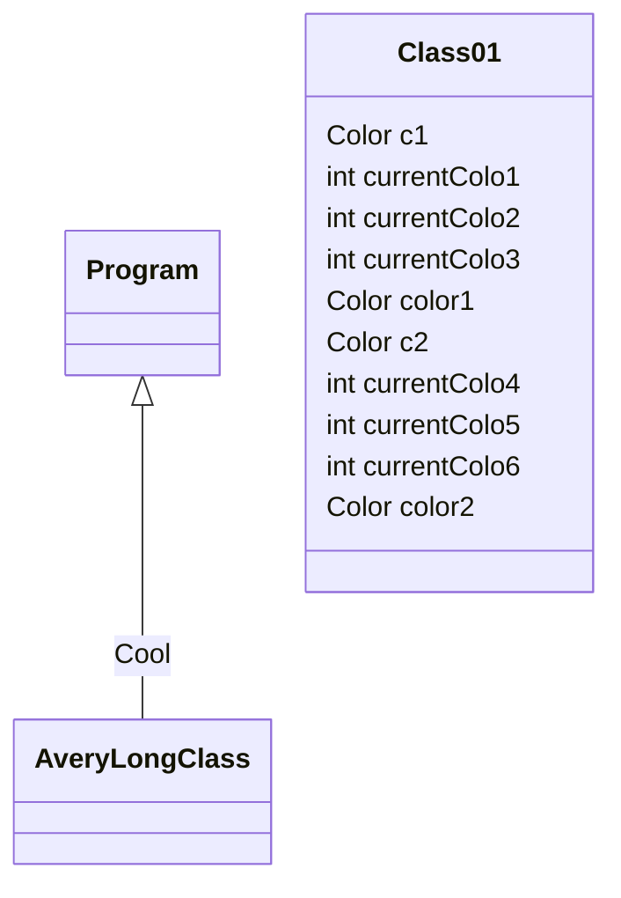

### Flowchart

```mermaid
 classDiagram
Program <|-- AveryLongClass : Cool

Class01 : Color c1
Class01 : int currentColo1
Class01 : int currentColo2
Class01 : int currentColo3
Class01 : Color color1
Class01 : Color c2
Class01 : int currentColo4
Class01 : int currentColo5
Class01 : int currentColo6
Class01 : Color color2


```
