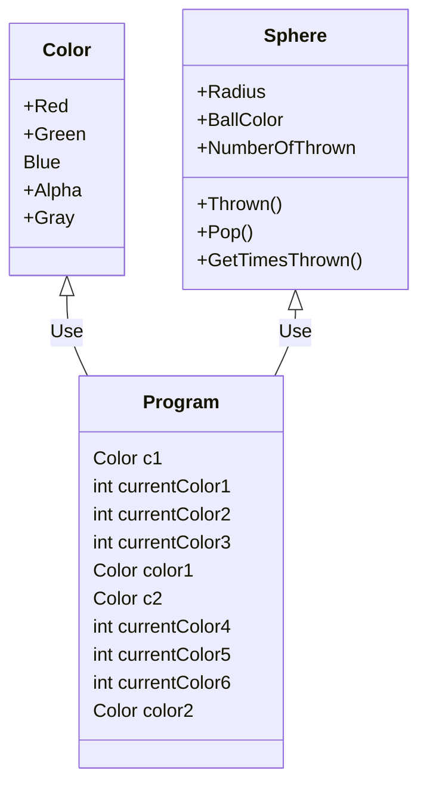

### Flowchart

```mermaid
 classDiagram
Color <|-- Program : Use
Sphere <|-- Program : Use

Program : Color c1
Program : int currentColor1
Program : int currentColor2
Program : int currentColor3
Program : Color color1
Program : Color c2
Program : int currentColor4
Program : int currentColor5
Program : int currentColor6
Program : Color color2

Color : +Red
Color : +Green
Color : Blue
Color : +Alpha
Color : +Gray

Sphere : +Radius
Sphere : +BallColor
Sphere : +NumberOfThrown
Sphere : +Thrown()
Sphere : +Pop()
Sphere : +GetTimesThrown()


```
