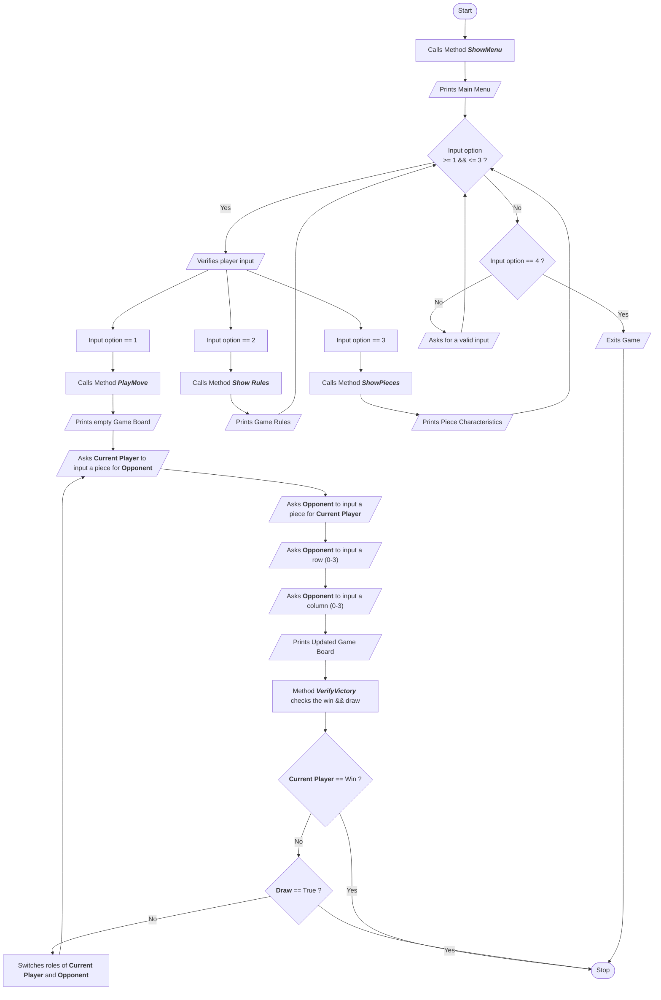

### Flowchart

```mermaid
  flowchart TD;
      
      Start([Start]) --> id1["`Calls Method _**ShowMenu**_`"];
      id1 --> id2[/"`Prints Main Menu`"/];

      id3{"`Input option 
      >= 1 && <= 3 ?`"};

      id2 --> id3;
      

      id3 -- Yes --> id4[/"`Verifies player input`"/];

      id4 --> id8["`Input option == 1`"];

      id8 --> id15["`Calls Method _**PlayMove**_`"];
      id15 --> id16[/"`Prints empty Game Board`"/];
      id16 --> id17[/"`Asks **Current Player** to input a piece for **Opponent**`"/];
      id17 --> id18[/"`Asks **Opponent** to input a piece for **Current Player**`"/];
      id18 --> id19[/"`Asks **Opponent** to input a row (0-3)`"/];
      id19 --> id20[/"`Asks **Opponent** to input a column (0-3)`"/];

      

      id20 --> id21[/"`Prints Updated Game Board`"/];
      id21 --> id32["`Method _**VerifyVictory**_ checks the win && draw`"];

      id32 --> id33{"`**Current Player** == Win ?`"};
      id33 -- No --> id35{"`**Draw** == True ?`"};

      id35 -- No --> id37["`Switches roles of **Current Player** and **Opponent**`"];
      id37 --> id17;
      
      id33 -- Yes --> Stop([Stop])
      id35 -- Yes --> Stop
      
      
   
      id4 --> id9["`Input option == 2`"];

      id9 --> id11["`Calls Method _**Show Rules**_`"];
      id11 --> id12[/"`Prints Game Rules`"/];
      id12 --> id3
      
      id4 --> id10["`Input option == 3`"];

      id10 --> id13["`Calls Method _**ShowPieces**_`"];
      id13 --> id14[/"`Prints Piece Characteristics`"/];
      id14 --> id3


      id3 -- No --> id5{"`Input option == 4 ?`"};
      id5 -- Yes --> id6[/"`Exits Game`"/];
      id6 --> Stop;
      id5 -- No --> id7[/"`Asks for a valid input`"/];
      id7 --> id3;    

```
