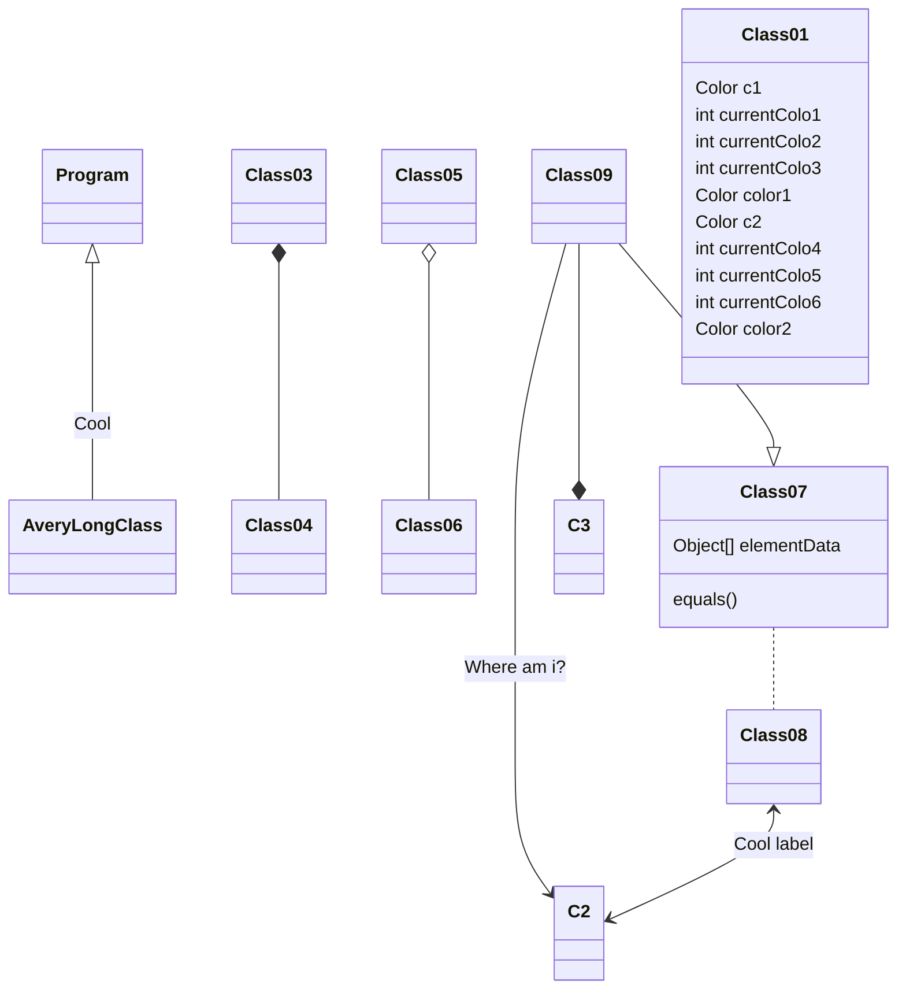

### Flowchart

```mermaid
 classDiagram
Program <|-- AveryLongClass : Cool
Class03 *-- Class04
Class05 o-- Class06
Class07 .. Class08
Class09 --> C2 : Where am i?
Class09 --* C3
Class09 --|> Class07
Class07 : equals()
Class07 : Object[] elementData
Class01 : Color c1
Class01 : int currentColo1
Class01 : int currentColo2
Class01 : int currentColo3
Class01 : Color color1
Class01 : Color c2
Class01 : int currentColo4
Class01 : int currentColo5
Class01 : int currentColo6
Class01 : Color color2
Class08 <--> C2: Cool label


```
